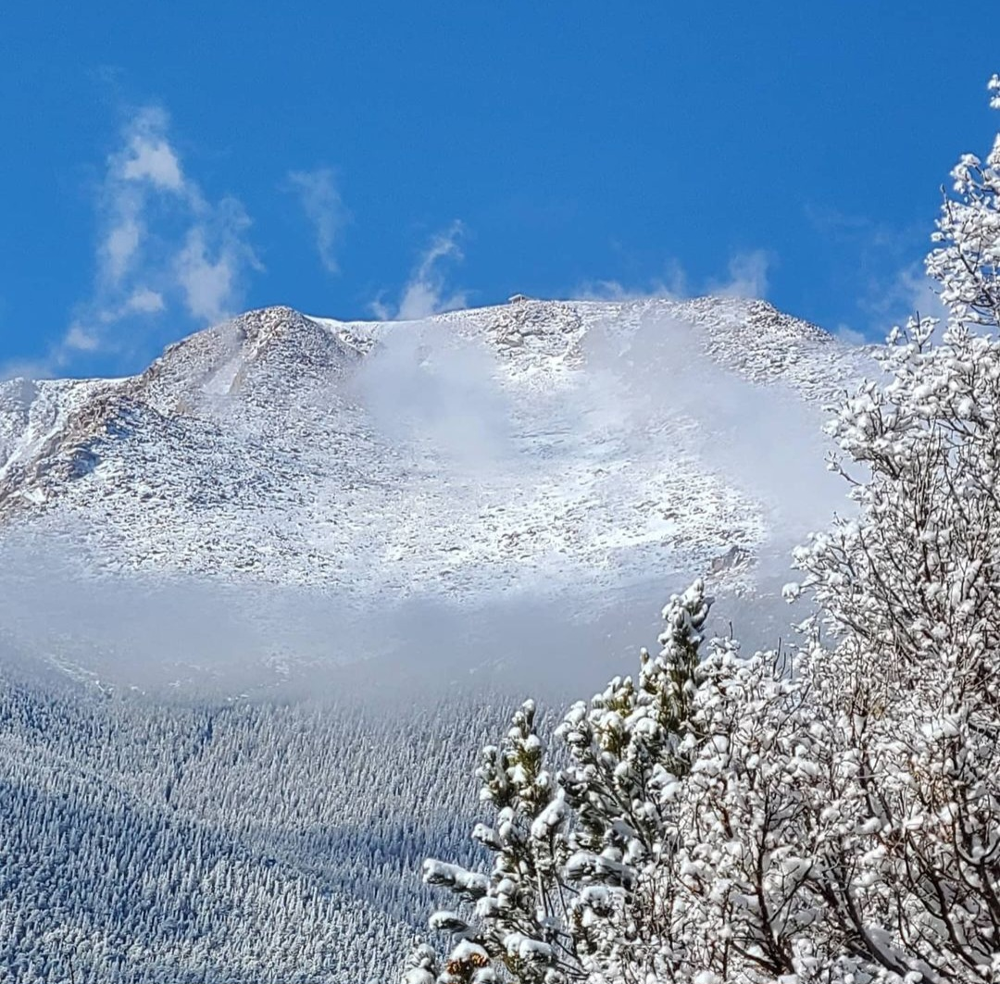

# Surviving High Altitudes: Pikes Peak

Pikes Peak, also known as "America's Mountain", is a famous fourteener located in the Rocky Mountains of Colorado. Standing at an elevation of 14,115 feet, Pikes Peak offers breathtaking views and a sense of accomplishment for those who reach its summit. In this article, I want to share my tips and experiences with fellow hikers who are planning to tackle Pikes Peak. Whether you're a beginner or an experienced hiker, my hope is that this article will provide valuable insights and make your hike up Pikes Peak more enjoyable. So lace up your hiking boots and let's explore Pikes Peak together! 

## How to Prepare, Stay Safe, and Overcome Hazards
Before embarking on any hike, it is important to consider the potential hazards and safety precautions that need to be taken. This is especially crucial when attempting a challenging summit like Pikes Peak.Prioritize safety by preparing, staying hydrated, and learning emergency procedures to significantly reduce risks on challenging hikes like Pikes Peak. Educate yourself about potential hazards and how to mitigate them to ensure a safe adventure. Always put safety first in any hiking endeavor.

### Altitude Sickness
One of the most common hazards hikers face on Pikes Peak is altitude sickness. As you ascend to higher altitudes, the air becomes thinner and oxygen levels decrease, which can lead to symptoms such as headaches, nausea, and dizziness. It is important to be aware of these symptoms and take necessary breaks or descend if needed.

### Rapid Temperature Changes
Rapid temperature changes present another hazard to keep in mind. On Pikes Peak, the climate can shift swiftly, causing temperatures to drop as much as four degrees for every 1,000 feet you climb. This drop can pose risks to hikers who haven't prepared with the right clothing and gear. Packing warm layers and staying informed about the weather forecast are key steps before embarking on your hike. Be aware that hypothermia can occur even in temperatures as high as the mid-50s, while heat exhaustion and heat stroke also pose risks in warmer conditions.

### Preparing for the Hike
Proper preparation is crucial for a successful hike up Pikes Peak. Start by ensuring you have the necessary gear and clothing for the mountain's conditions, including sturdy hiking boots, layered clothing, a backpack with essentials like water and snacks, and trekking poles for extra support if needed. The high altitude and challenging terrain of Pikes Peak demand a lot from your body, making it essential to hydrate well and eat nutrient-rich foods before and during your hike. Also, prepare yourself mentally and physically. Understanding the challenges ahead and maintaining a positive mindset are key to conquering Pikes Peak's demanding ascent.

Now that we have covered preparation, let's dive into my own adventures hiking Pikes Peak!

## My Experience Hiking Pikes Peak

### Challenges Faced and How I Overcame Them
My hike up Pikes Peak came with its fair share of challenges. On my first attempt, warm temperatures hit 79 degrees Fahrenheit, leading my companion to run out of water halfway. This incident underscored the crucial need for proper hydration and reminded us of the mountain's unpredictable weather. Despite this setback, we managed to reach Barr Camp to refill our water and press on.

In November 2023, the challenges intensified. A friend suffered severe altitude sickness and couldn't continue past the A-frame shelter. Initially planning to descend via the Cog Railway, his condition forced us to choose between continuing alone or turning back to hike an extra 7 miles. Prioritizing safety over convenience, we opted to return on foot. This decision was complicated as darkness fell and the cold set in, revealing my underestimation of how quickly my body would cool. I had to contact Search and Rescue, hindered by my gloves making it hard to use my phone.

Despite these obstacles, we made it back to Barr Camp, greeted by warmth and a chance to recover by the fire. This journey taught me valuable lessons about preparation, the necessity of accessible warm clothing, and the importance of understanding both my own and my companions' limits before starting an outdoor adventure.

### The Importance of Being Prepared

The Importance of Being Prepared
My journey up Pikes Peak underscored the critical role of preparation for any hike. Ensuring you have sufficient water and snacks, the right gear and clothing, and a well-understood route can make or break your hiking experience.

A lifesaver in my pack is my life straw, a compact and light filter that lets me safely drink from any water source. This tool has prevented dehydration on several occasions, proving indispensable for outdoor activities.

Planning your route in advance is also key. This means familiarizing yourself with the trail's length, elevation gain, possible weather scenarios, and locations of emergency exits or shelters.

Understanding your physical limits and those of your hiking partners is another essential aspect of preparation. Conditions like altitude sickness and fatigue can significantly affect your hike, so it's important to consider these risks beforehand.

In essence, thorough preparation is vital for a safe and enjoyable hike. It not only safeguards your health but could also be crucial in aiding fellow hikers. Therefore, always review your gear, pack ample water and snacks, and study your trail before setting off on any outdoor adventure. Remember, being ready for the unexpected can dramatically enhance your hiking experience.

## Happy Hiking!
Hiking Pikes Peak is an incredible experience and remains one of my most cherished adventures. The breathtaking views, challenging terrain, and sense of accomplishment upon reaching the summit make every step worthwhile. From the Barr Trail to the summit, every step offers its own unique challenges and rewards. With proper preparation, determination, and a passion for adventure, anyone can conquer this iconic mountain. But don't just take my word for it, lace up your hiking boots and go experience it for yourself! For a more detailed account of each trip, make sure to check out my [blog](https://KershiaMukoro.github.io/blog
). Happy hiking!
